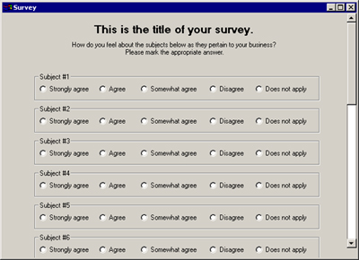



## Survey

### Description

This code collects answers from option arrays and text boxes and saves them to a text file. The data could easily be saved to a database. The code has validation and scroll bars and can be customized for a wide variety of business uses.
 
### More Info
 

             |
---                |---
**Submitted On**   |2001-08-01 09:21:54
**By**             |[John Doe](https://github.com/Planet-Source-Code/PSCIndex/blob/master/ByAuthor/john-doe.md)
**Level**          |Intermediate
**User Rating**    |4.3 (17 globes from 4 users)
**Compatibility**  |VB 6\.0
**Category**       |[Complete Applications](https://github.com/Planet-Source-Code/PSCIndex/blob/master/ByCategory/complete-applications__1-27.md)
**World**          |[Visual Basic](https://github.com/Planet-Source-Code/PSCIndex/blob/master/ByWorld/visual-basic.md)
**Archive File**   |[Survey23883812001\.zip](https://github.com/Planet-Source-Code/john-doe-survey__1-25733/archive/master.zip)

